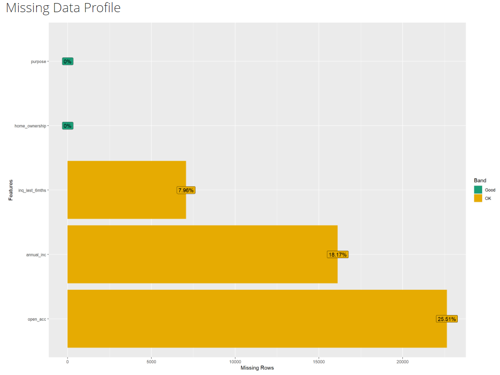

```{r}
#| label: setup
#| include: false
#| message: false
#| warning: false

if (!require("data.table")) install.packages("data.table")
if (!require("DataExplorer")) install.packages("DataExplorer")
if (!require("dplyr")) install.packages("dplyr")
if (!require("tidyr")) install.packages("tidyr")
# if (!require("skimr")) install.packages("skimr")
if (!require("ggplot2")) install.packages("ggplot2")
# if (!require("GGally")) install.packages("GGally")

library(data.table)
library(DataExplorer)
library(dplyr)
library(tidyr)
#library(skimr)
library(ggplot2)
#library(GGally)
```

# Task 1

## Data Loaded

```{r}
myLCdata <- fread("myLCdata.csv")
```

## Data dirtyfied

```{r}
#| label: apply-dirtyfy
#| message: false
#| warning: false
# Dirtyfy data and store it so we work with the same dirtyfy data
# dirtyfy <- readRDS("dirtyfy.rds")
# myLCdata_dirty <- dirtyfy(myLCdata, 3)
# fwrite(myLCdata_dirty, file = "myLCdata_dirty.csv")
myLCdata_dirty <- fread("myLCdata_dirty.csv")
```

## Automatic EDA report

The following command was used to generate an automatic EDA report for `myLCdata_dirty`. As required, it was executed in the R console and is shown here only for documentation purposes.

```{r}
#| eval: false
#| echo: false
#| 
create_report(myLCdata_dirty, output_file = "EDA_report_P2_03.html")
```

## Missing Data Profile

Figure 1 shows the Missing Data Profile generated from the dirty private data set.

```{r}
#| echo: false
#| fig-cap: "Missing Data Profile of the dirty private data set."

```

# Task 2

## Special values in character attributes

```{r}
summary(myLCdata_dirty)
```

First We count special values for character features \### All columns \#### Number of NA

```{r}
num_na <- myLCdata_dirty %>% summarize(across(everything(), ~sum(is.na(.))))
num_na
```

### Numeric Columns

#### Number of NaN

```{r}
num_nan <- myLCdata_dirty %>% summarize(across(where(is.numeric), ~sum(is.nan(.))))
num_nan
```

#### Number of Outliers

```{r}
# Normal way
num_outliers <- myLCdata_dirty %>% summarize(across(where(is.numeric), ~length(boxplot.stats(.)$out)))
num_outliers
# Fancy way; Same output
# myLCdata_dirty %>% summarize(across(where(is.numeric), ~sum(
#     boxplot.stats(.)$stats[1] > . | . > boxplot.stats(.)$stats[5],
#     na.rm = TRUE
#   )))

```

### Character Columns

#### Special Strings "n/a"

```{r}

num_na_string <- myLCdata_dirty %>% summarize(across(where(is.character), ~sum(
    . == "n/a"
  )))
num_na_string
```

#### Special Strings Space " "

```{r}

num_white_space <- myLCdata_dirty %>% summarize(across(where(is.character), ~sum(
    . == " "
  )))
num_white_space
```

#### Special Strings Empty String ""

```{r}

num_empty_string <- myLCdata_dirty %>% summarize(across(where(is.character), ~sum(
    "" == .
  )))
num_empty_string 
```


##Task2.2

```{r}
#total number of rows
total_rows = sapply(myLCdata_dirty, length)

#summing up the special values

total_special = bind_rows(num_na, num_nan, num_outliers, num_na_string, num_white_space, num_empty_string) %>%
  summarise(across(everything(), ~sum(., na.rm = TRUE)))

relative_counts = total_special / total_rows

relative_counts


```

##Task 2.3

###numeric attributes

```{r}
# Total rows
num_total = nrow(myLCdata_dirty)

# numeric_na metric
numeric_na = myLCdata_dirty %>% summarize(across(where(is.numeric), ~sum(is.na(.))))

# table
numeric_result_table = data.frame(
  attribute     = names(numeric_na),
  perc_NA       = as.numeric(numeric_na / num_total),
  perc_NaN      = as.numeric(num_nan / num_total),
  perc_outliers = as.numeric(num_outliers / num_total)
)

numeric_result_table

```


###character attribute
```{r}

# character_na metric
character_na = myLCdata_dirty %>% summarize(across(where(is.character), ~sum(is.na(.))))

#character table
character_result_table = data.frame(
  attribute = names(character_na),
  perc_NA = as.numeric(character_na / num_total),
  perc_empty_string = as.numeric(num_empty_string / num_total),
  perc_space = as.numeric(num_white_space / num_total),
  perc_na_string = as.numeric(num_na_string / num_total)
)

character_result_table


```

##Task 2.4

```{r}

#numeric tidy table

tidy_numeric_result_table = numeric_result_table %>%
  pivot_longer(
    cols = starts_with("perc_"),
    names_to = "metric",
    values_to = "value"
  )
tidy_numeric_result_table

#character tidy table

tidy_character_result_table = character_result_table %>%
  pivot_longer(
    cols = starts_with("perc_"),
    names_to = "metric",
    values_to = "value"
  )

tidy_character_result_table
```

##Task 2.5

###numeric table
```{r}

ggplot(tidy_numeric_result_table, aes(x = attribute, y = value, fill = metric)) +
  geom_col(position = "dodge") +
  labs(
    title = "Numeric Variables Quality Metrics",
    x = "Attribute",
    y = "Proportion",
    fill = "Metric"
  ) +
  scale_y_continuous(labels = scales::percent)+
  coord_flip()
```

###character table

```{r}
ggplot(tidy_character_result_table, aes(x= attribute, y = value, fill = metric))+
  geom_col(position = "dodge")+
  labs(
    title = "Character Variables Quality Metrics",
    x = "Attribute",
    y = "Proportion"
    )+
  coord_flip()+
  scale_y_continuous(labels = scales::percent)
  


```

